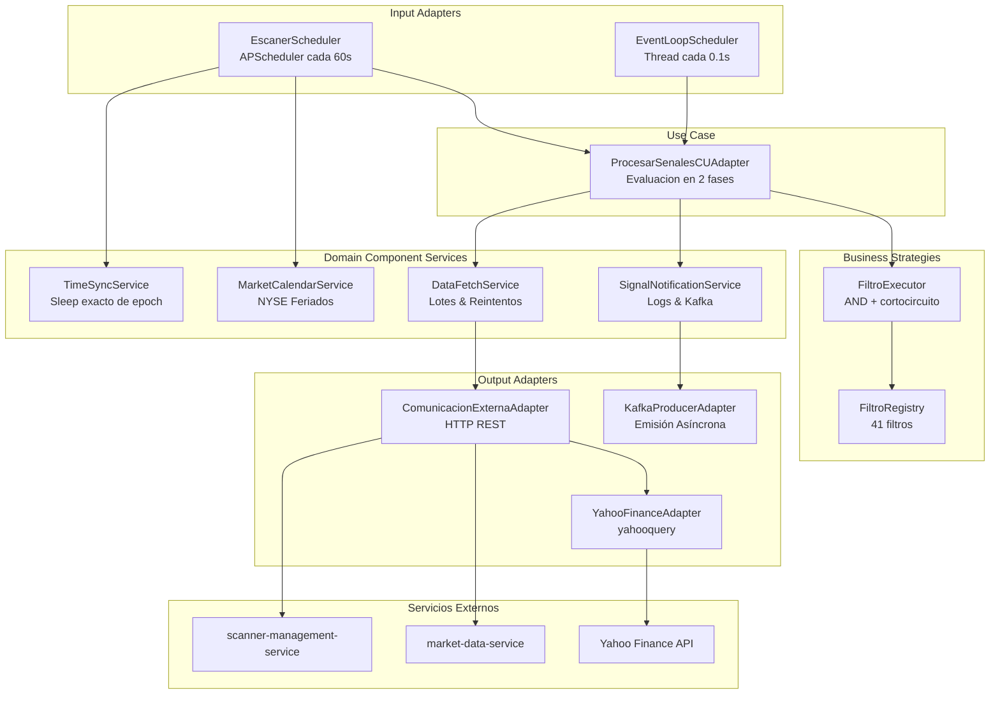

# Signal Processing Service

Microservicio en Python que ejecuta los escaneres configurados en `scanner-management-service`. Obtiene escaneres activos, simbolos por mercado, data historica y datos fundamentales, y evalua los 41 filtros configurados para generar senales.

## Arquitectura



## Evaluacion en Dos Fases

El servicio clasifica los filtros de cada escaner en dos tipos y los evalua en fases separadas:

### Fase 1 — Filtros de Estado (cada 60s, velas cerradas)

Filtros cuyo valor cambia lentamente y se confirma con el close de la vela:

- Volumen: VOLUME, AVERAGE_VOLUME, VOLUMEN_POST_PRE, RELATIVE_VOLUME, RELATIVE_VOLUME_SAME_TIME, VOLUME_SPIKE
- Precio: PRECIO, CHANGE, PERCENTAGE_CHANGE, GAP_FROM_CLOSE, POSITION_IN_RANGE, PERCENTAGE_RANGE, RANGE_DOLLARS
- Volatilidad: ATR, ATRP, RELATIVE_RANGE
- Momentum: RSI, DISTANCE_FROM_VWAP, DISTANCE_FROM_EMA, DISTANCE_FROM_MA, EMA_VWAP_SUPPORT_RESISTANCE
- Patrones: BEARISH_BULLISH_ENGULFING, CONSECUTIVE_CANDLES, FIRST_CANDLE, PERCENTAGE_PULLBACK_HIGHS_LOWS, PIVOTS, MINUTOS_IN_MARKET
- Fundamentales: FLOAT, SHARES_OUTSTANDING, MARKET_CAP, SHORT_INTEREST, SHORT_RATIO, DAYS_UNTIL_EARNINGS, NOTICIAS

### Fase 2 — Filtros de Evento (cada 0.1s, barra en formacion)

Filtros que detectan eventos puntuales usando la barra en formacion del market-data-service (`GET /historical/{symbol}/current`):

- CROSSING_ABOVE_BELOW
- BREAK_OVER_RECENT_HIGHS_LOWS
- HIGH_LOW_OF_DAY
- NEW_CANDLE_HIGH_LOW
- OPENING_RANGE_BREAKOUT
- OPENING_RANGE_BREAKDOWN
- BACK_TO_EMA_ALERT
- THROUGH_EMA_VWAP_ALERT
- HALT

### Flujo

```
Cada 60s (APScheduler):
  ejecutar_escaner(escaner)
    |-- clasificar_filtros -> state_filters + event_filters
    |
    |-- Si NO hay event_filters -> flujo clasico (todos con velas cerradas)
    |
    '-- Si hay event_filters:
          Para cada simbolo (20 hilos):
            |-- descargar candles cerradas + fundamentales
            |-- evaluar state_filters (AND + cortocircuito)
            |-- Si FALLA -> descartar simbolo
            '-- Si PASA -> registrar en watchlist

Cada 0.1s (EventLoopScheduler):
  _tick()
    |-- recolectar simbolos del watchlist
    |-- obtener barras en formacion en paralelo
    '-- para cada (escaner, symbol):
          |-- reemplazar candles[-1] con barra en formacion
          |-- ejecutar event_filters (AND + cortocircuito)
          |-- Si PASA -> Senal + remover del watchlist
          '-- Si FALLA -> se re-evalua en 0.1s
```

Ambas fases deben cumplirse (AND): un simbolo que no pasa filtros de estado nunca llega a fase 2.

## Dependencias Externas

| Servicio                   | Endpoint                                          | Datos                                                  |
| -------------------------- | ------------------------------------------------- | ------------------------------------------------------ |
| scanner-management-service | `GET /api/escaner`                                | Escaneres activos con filtros                          |
| market-data-service        | `GET /api/marketdata/markets`                     | Mercados disponibles                                   |
| market-data-service        | `GET /api/marketdata/symbols?markets=...`         | Simbolos por mercado                                   |
| market-data-service        | `GET /api/marketdata/historical/{symbol}`         | Candles OHLCV cerradas                                 |
| market-data-service        | `GET /api/marketdata/historical/{symbol}/current` | Barra en formacion                                     |
| market-data-service        | `GET /api/marketdata/historical/{symbol}/last`    | Ultima barra cerrada                                   |
| market-data-service        | `GET /api/marketdata/quote/{symbol}`              | Quote actual                                           |
| market-data-service        | `GET /api/marketdata/earnings/{symbol}`           | Dias hasta earnings                                    |
| market-data-service        | `POST /api/marketdata/orders`                     | Orden bracket (OTOCO)                                  |
| market-data-service        | `DELETE /api/marketdata/orders/{id}`              | Cancelar orden                                         |
| Yahoo Finance (yahooquery) | Python directo                                    | float, shares outstanding, short interest, short ratio |

## Estructura

```
signal-processing-service/
├── main.py                          # Entry point, composicion de dependencias
├── config.py                        # URLs (env vars), concurrencia, timeouts
├── Dockerfile
├── requirements.txt
├── .github/workflows/
│   ├── ci.yml                       # Build + push Docker image
│   └── cd.yml                       # Deploy en self-hosted runner
├── application/
│   ├── input/
│   │   └── procesar_senales_cu_int_port.py
│   └── output/
│       └── comunicacion_externa_int_port.py
├── domain/
│   ├── enums/                       # EnumFiltro, EnumParametro, etc.
│   ├── models/                      # Escaner, Candle, Senal, DatosFundamentales
│   ├── services/                    # Componentes modulares
│   │   ├── time_sync_service.py     # Sleep epoch-exacto
│   │   ├── market_calendar_service.py # Feriados NYSE
│   │   ├── data_fetch_service.py    # Batch fetcher con reintentos
│   │   └── signal_notification_service.py
│   └── usecases/
│       └── procesar_senales_cu_adapter.py   # Orquestador (2 fases + deduplicacion)
└── infrastructure/
    ├── input/
    │   ├── scheduler/
    │   │   ├── escaner_scheduler.py         # Programador delegando a TimeSync
    │   │   └── event_loop_scheduler.py      # Thread daemon (0.1s)
    │   └── api/
    │       └── fastapi_controller.py        # Webhooks POST/DELETE
    ├── output/
    │   └── comunicacion_externa/
    │       ├── comunicacion_externa_adapter.py
    │       ├── market_data_adapter.py
    │       ├── scanner_management_adapter.py
    │       └── yahoo_finance_adapter.py
    └── business/
        └── strategies/
            ├── base_filtro.py               # ABC con helpers (EMA, SMA, RSI, VWAP)
            ├── filtro_registry.py           # Registry + EVENT_FILTERS clasificacion
            ├── filtro_executor.py           # AND + cortocircuito
            ├── volumen/                     # 6 filtros
            ├── precio_y_movimiento/         # 9 filtros
            ├── volatilidad/                 # 3 filtros
            ├── momentum_e_indicadores/      # 4 filtros (+3 DISTANCE combinados)
            ├── tiempo_y_patrones/           # 11 filtros
            └── fundamentales/               # 7 filtros
```

## Configuracion

Todas las variables son configurables via variables de entorno (para Docker/prod):

| Variable                         | Default                     | Descripcion                        |
| -------------------------------- | --------------------------- | ---------------------------------- |
| `SCANNER_SERVICE_URL`            | `http://localhost:8080/api` | URL del scanner-management-service |
| `MARKETDATA_SERVICE_URL`         | `http://localhost:8080/api` | URL del market-data-service        |
| `MAX_WORKERS_ESCANERES`          | `10`                        | Hilos para escaneres en paralelo   |
| `MAX_WORKERS_SIMBOLOS`           | `20`                        | Hilos para simbolos en paralelo    |
| `REQUEST_TIMEOUT`                | `30`                        | Timeout HTTP en segundos           |
| `POLLING_INTERVAL_SECONDS`       | `60`                        | Intervalo del scheduler (fase 1)   |
| `EVENT_POLLING_INTERVAL_SECONDS` | `0.1`                       | Intervalo del event loop (fase 2)  |
| `MAX_SYMBOLS_REALTIME`           | `50`                        | Tope de simbolos en watchlist      |
| `SIGNAL_COOLDOWN_SECONDS`        | `300`                       | Cooldown entre senales duplicadas  |

## Ejecucion Local

```bash
python -m venv venv
venv\Scripts\activate        # Windows
pip install -r requirements.txt
python main.py
```

Requiere que `scanner-management-service` y `market-data-service` esten corriendo (via Gateway en puerto 8080).

## Docker

```bash
docker build -t signal-processing-service .
docker run -p 8000:8000 \
  -e SCANNER_SERVICE_URL=http://gateway:8080/api \
  -e MARKETDATA_SERVICE_URL=http://gateway:8080/api \
  signal-processing-service
```

O con docker-compose desde la raiz del proyecto:

```bash
docker-compose up signal-processing-service
```
